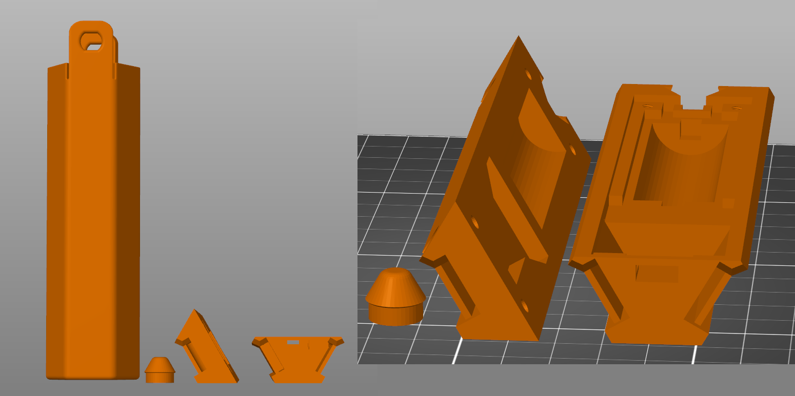

# Open Pixel Poi Body

In this folder resides the [3mf](OpenPixelPoiAllParts.3mf) which contains all the parts of a single poi body. You may need to split the object to seperate out the parts.

I've been printing all the main body parts in PLA without any care for the slicer profile. I don't think it makes much difference. Perhaps PETG would be better.

The outer shell should be printed in clear TPU. Ive been using 20% gyroid infill and it has decent diffusion, tho I suspect this can be improoved upon. I did try 100% infill and the diffusion was far worse so I dont reccomend that. The shell was also pretty stiff and would probably hurt more on impacts. I may design a mold for making this part out of silicone at a later date.

The spacer might be considered optional as it is quit finiky to insert durring assembly. However if you don't use it, make sure you have some protection between your battery terminal and anything it can short on.

The parts all print without supports when oriented like this.

