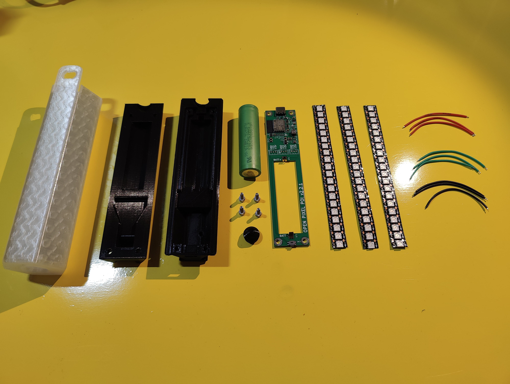
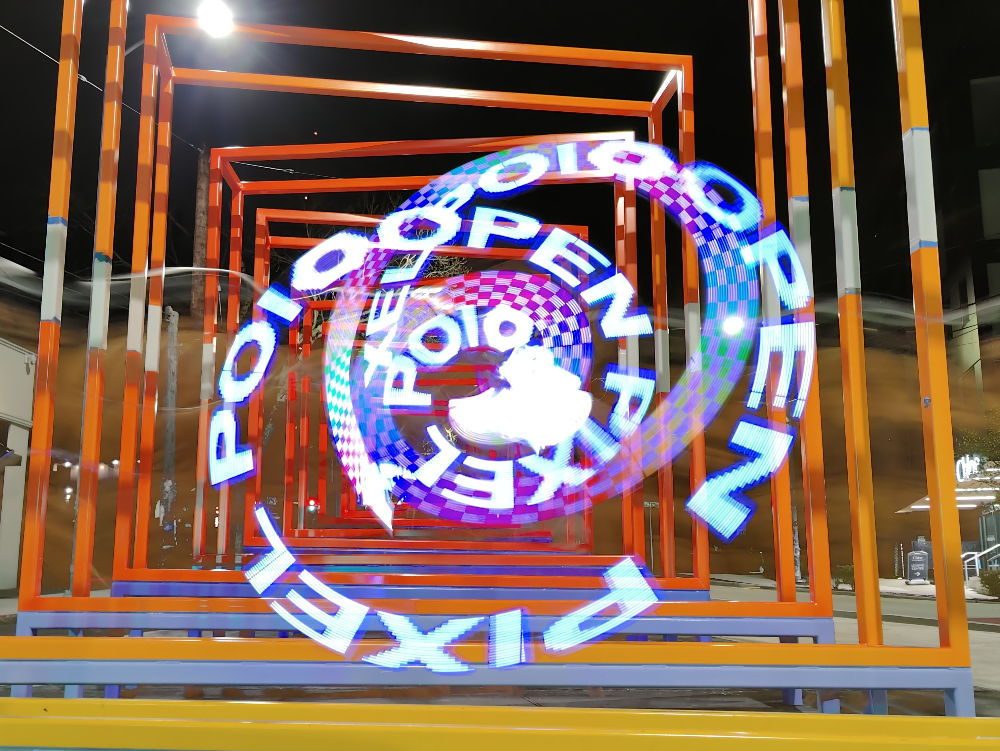

<h1>
Open Pixel Poi

</h1>

<h4>
  <a href="https://discord.gg/hErUF8A4">Store</a>
  ·
  <a href="./Firmware/MANUAL.md">User Guide</a>
  ·
  <a href="./Hardware/3D Printable Body/README.md">3D Models</a>
  ·
  <a href="./Hardware/Assembly/README.md">Assembly</a>
  ·
  <a href="./Software/README.md">Android App</a>
  ·
  <a href="https://mitchlol.github.io/#openpixelpoi">Firmware Tool</a>
  ·
  <a href="https://discord.gg/hErUF8A4">Discord</a>
</h4>

Open Pixel Poi  is an open source, 3D printable, LED pixel Poi, based around ESP32, WS2812B, and FFF/FDM manufacturing.
Designed to be simple, afforable, repairable, and customizable.

#### License
[Licensed  with GPLv3](https://www.gnu.org/licenses/gpl-3.0.en.html)
Suggested donation of 5$ per set of Poi built via [paypal](https://www.paypal.com/donate/?business=MTYSHEQVNBVNQ&amount=5&no_recurring=1&item_name=For+Creating+%26+Maintaing+Open+Pixel+Poi&currency_code=USD) or purchase PCBs from store link.
