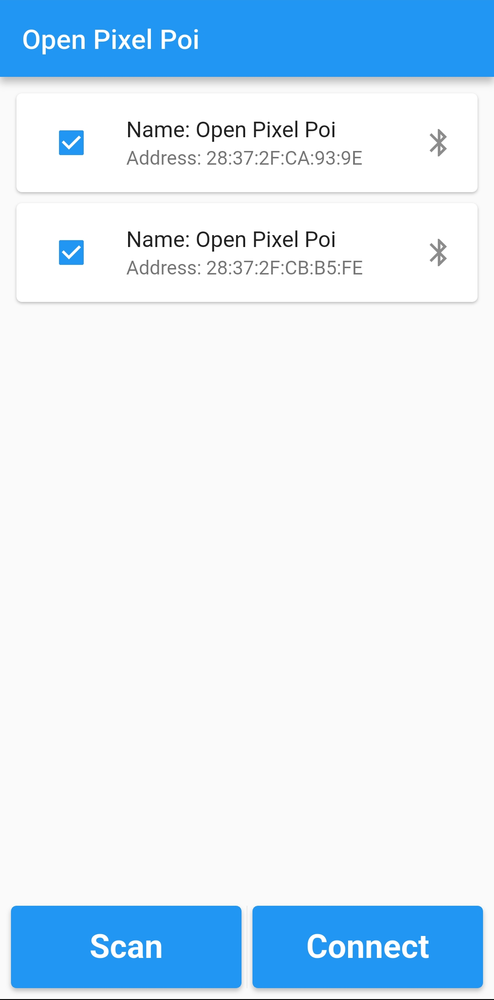
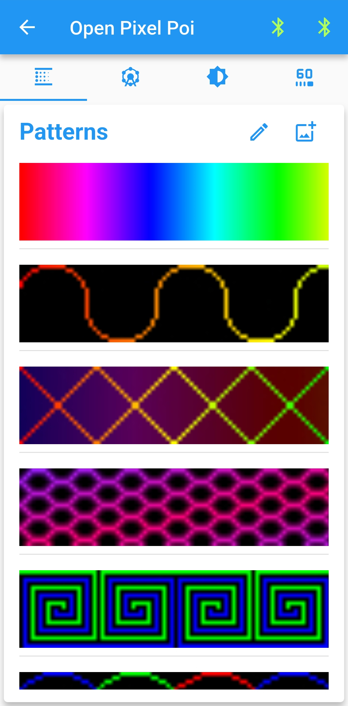
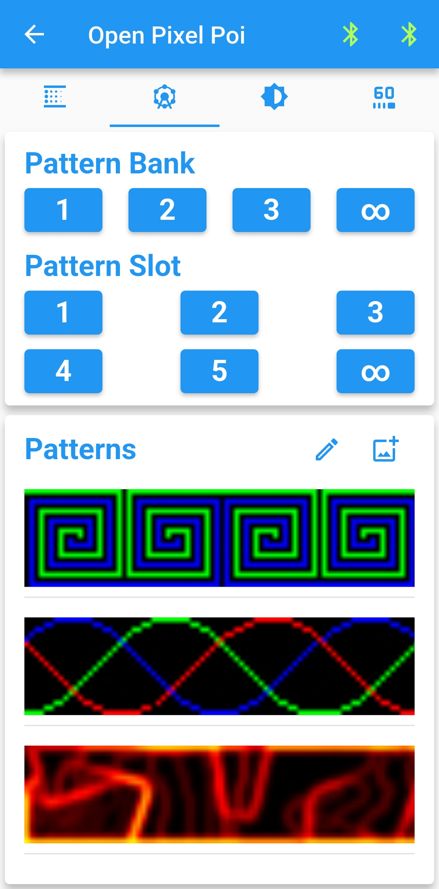
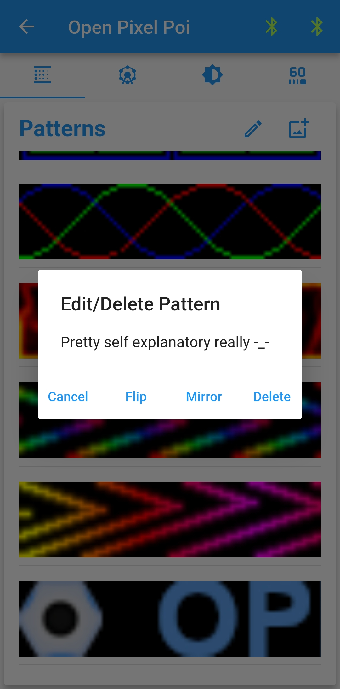
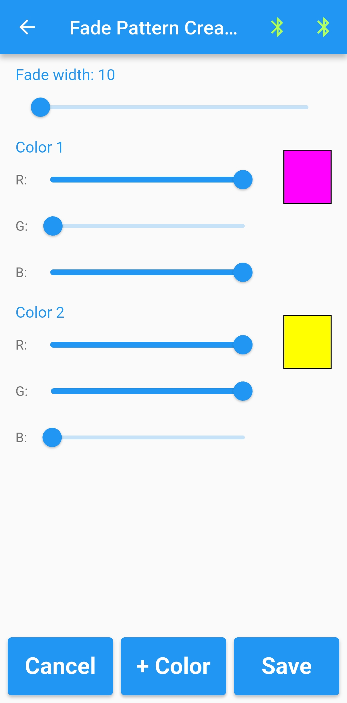

# Open Pixel Poi Software
This is a flutter app, it is designed to run on android. No other systems have been configured yet.

## Android Releases
[Open Pixel Poi v1.0.0](./open_pixel_poi_v1.0.0.apk)
